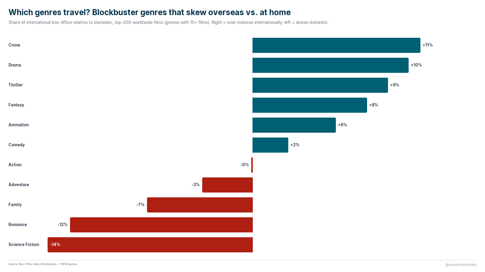

**[@unwelcomedata](https://unwelcomedata.github.io/highest-grossing-films/)** · data from public sources

# "Highest-grossing" depends entirely on how you count

Ask which films are the biggest ever and you'll get three different answers
depending on where and when you measure. This project lays the three lenses side
by side — **domestic vs. worldwide**, **nominal vs. inflation-adjusted**, and
**by genre** — because the disagreements between them are the interesting part.

**The findings:**

- **Most of the money is overseas.** For nearly every top film, the international
  (rest-of-world) box office dwarfs the domestic (U.S. & Canada) take. *Avatar*
  made $785M at home and **$2.1B** abroad. The extreme case: **Ne Zha 2** (2025)
  grossed **$2.25B internationally on just $23M domestic** — a global blockbuster
  almost nobody in the U.S. saw.
- **Adjust for inflation and the "biggest domestic film" is from 1939.** Measured
  in 2022 dollars, *Gone with the Wind* still tops the domestic chart (~$1.9B),
  ahead of *Star Wars* (1977) — the modern hits only lead the *nominal* board.
- **Story genres travel; spectacle skews home.** Among the top-200 worldwide
  films, Crime, Drama, Thriller and Fantasy earn a *bigger* share of their money
  abroad than at home, while — surprisingly — **Science Fiction skews the most
  domestic**.

---

## 1. Where the money comes from: overseas

Top 15 films by worldwide gross. Gold = domestic (U.S. & Canada), teal =
international. The connector length is how lopsided each film is toward overseas.

## 2. Which genres travel?

Each genre's share of *international* box office relative to its share of
*domestic*, for the top-200 worldwide films. Right = over-indexes abroad; left =
skews domestic. (Genres with 10+ films; see the method note on multi-genre films.)

## 3. The biggest *domestic* films, adjusted for inflation

A different question entirely: within the U.S. & Canada, adjusted for ticket-price
inflation, who sold the most tickets? Gold = nominal (release-year $), teal =
adjusted to 2022 $.

---

## How it was measured

- **Worldwide / domestic / international** grosses are **nominal** (year-of-release
  dollars) from Box Office Mojo. Domestic = U.S. & Canada; international =
  everywhere else. Nominal dollars favor recent films (higher prices, more
  markets) — which is exactly why the adjusted domestic chart tells a different
  story.
- **The adjusted domestic chart** uses *ticket-price* inflation (estimated tickets
  sold × the 2022 average ticket price), not CPI. It effectively ranks by tickets
  sold. Classics' totals include decades of re-releases.
- **Genre** comes from TMDB, matched by title + year. In the "which genres travel"
  chart, each film's gross is attributed to *every* one of its genres, so grosses
  double-count across genres; the metric is a **ratio** (international share ÷
  domestic share), which stays valid under that attribution. The sample is
  already-global blockbusters, so read it as "among big hits, which genres lean
  which way."

Full per-source detail, definitions, and caveats are in [SOURCES.md](SOURCES.md).

---

## The data

Published datasets are in [`export/`](export/):

- `highest_grossing_films_v1.csv` — domestic, inflation-adjusted top 200 (adjusted
  + nominal gross, tickets, year, inflation multiple).
- `films_worldwide_v1.csv` — worldwide top 200 with domestic / international split.
- `films_genre_v1.csv` — genre(s) per film (TMDB).

Each ships with a `*_codebook.md` describing every column.

---

## Sources & license

Box Office Mojo (domestic adjusted + worldwide) and TMDB (genres). Full
attribution and caveats in [SOURCES.md](SOURCES.md). "This product uses the TMDB
API but is not endorsed or certified by TMDB." No crowd-edited sources are used.

---

> **AI-Assisted Development**
> This project was built with the assistance of [Kiro](https://kiro.dev), an
> AI-powered development environment. All data-sourcing decisions, methodology
> choices, and published findings are the responsibility of the author. AI was
> used for code generation, data-pipeline construction, and research assistance —
> not for analysis conclusions or editorial judgment.
