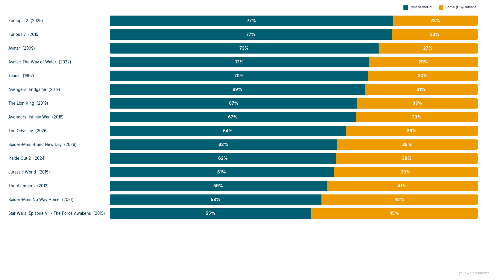
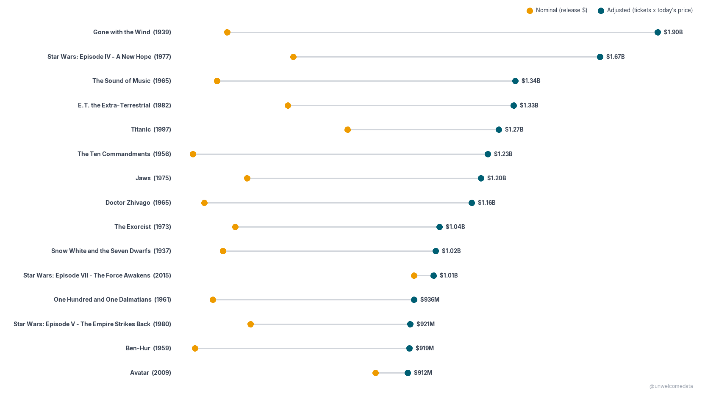
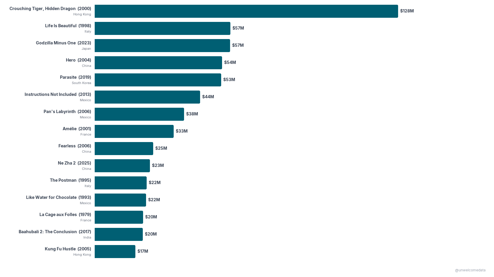

**[@unwelcomedata](https://github.com/unwelcomedata)** · data from public sources

# Highest-Grossing Films: it depends entirely on how you count

Ask which films are the biggest ever and you get different answers depending on
*where* and *when* you measure. This project lays a few honest lenses side by
side — **home vs. abroad**, **nominal vs. inflation-adjusted**, and **English vs.
foreign-language** — because the disagreements between them are the interesting
part.

**The findings:**

- **Hollywood's biggest films make most of their money abroad.** For nearly every
  top U.S.-produced film, the rest-of-world box office dwarfs the home (U.S. &
  Canada) take. *Avatar* made $785M at home and **$2.1B** abroad.
- **Adjust for inflation and the biggest domestic film is from 1939.** In constant
  2026 dollars (CPI-U), *Gone with the Wind* still tops the domestic chart
  (~$4.7B), ahead of *Snow White* (1937) and *Star Wars* (1977). Modern hits only
  lead the *nominal* board.
- **The foreign-language film that broke into the U.S. isn't a recent one.**
  *Crouching Tiger, Hidden Dragon* (2000) still leads U.S. box office for a
  non-English film (~$244M in today's dollars), ahead of *Life Is Beautiful*,
  *Hero*, and *Parasite*.

> **A note on "domestic."** Box Office Mojo's "domestic" means the **U.S. &
> Canada** market — which only equals a film's *home* market for U.S.-made films.
> So the home-vs-abroad chart is **restricted to U.S.-produced films**. A Chinese
> blockbuster like *Ne Zha 2* (~$2.3B, almost entirely at home) would otherwise
> look like it "earned it all abroad" when it earned it in its own country.

---

## 1. Hollywood's biggest films make most of their money abroad

Top 15 U.S.-produced films by worldwide gross, ordered by the share earned
abroad. Teal = rest of world, gold = home (U.S. & Canada) — the teal segment
grows for the more internationally-dependent films.

## 2. The biggest *domestic* films, adjusted for inflation

A different question: within the U.S. & Canada, once general inflation is
accounted for, who sold the most? Every film's lifetime gross is restated in
**constant 2026 dollars (CPI-U)**. The gold dot is what each film actually made
at the time (nominal); the connector shows how far inflation moves it.

## 3. The foreign-language films that broke into the U.S.

Which non-English-language films earned the most in the U.S. & Canada, in constant
2026 dollars. Country of origin is under each title — the list is more diverse than
you'd guess (Hong Kong, Italy, China, France, South Korea, Mexico).

---

## How it was measured

- **Home / abroad grosses** are **nominal** (year-of-release dollars) from Box
  Office Mojo's worldwide lifetime chart. Domestic = U.S. & Canada; the rest is
  "abroad." Chart 1 shows *shares* of each film's own total, so inflation doesn't
  distort it.
- **Inflation adjustment uses CPI-U, not ticket prices.** Charts 2 and 3 restate
  each film's nominal lifetime gross into **constant 2026 dollars** using the
  U.S. Consumer Price Index (CPI-U, all-items), on a trailing-12-month base. This
  is *general* inflation — deliberately a single, consistent basis across both
  charts. (It is **not** Box Office Mojo's own "ticket-price adjusted" figure,
  which only offers a 2022 base and no foreign version, so the numbers here differ
  from BOM's adjusted chart on purpose.)
- **Foreign-language** (chart 3) means non-English-language films, from Box Office
  Mojo's Foreign Language chart, ranked by U.S. & Canada lifetime gross. Country of
  origin comes from TMDB.
- **Re-releases** inflate the lifetime totals of some classics (*Gone with the
  Wind*, *Star Wars*, *E.T.* were re-released theatrically) — their totals reflect
  total historical audience, not one release.

**Snapshot as of September 2026.** Box-office figures are lifetime-to-date; films
still in theaters when the data was pulled (some 2026 titles) have totals that
will keep rising, so treat those as lower bounds.

Full per-source detail, definitions, and caveats are in [SOURCES.md](SOURCES.md).

---

## The data

Published datasets are in [`export/`](export/), each with a `*_codebook.md`
describing every column:

- `highest_grossing_films_v1.csv` — top domestic films, adjusted to constant 2026
  dollars (CPI-U) alongside nominal gross and release year.
- `films_worldwide_v1.csv` — worldwide top films with the home / abroad split.
- `films_foreign_us_v1.csv` — top foreign-language films by U.S. & Canada gross,
  with country of origin.

---

## Sources & license

Box Office Mojo (domestic, worldwide, and foreign-language lifetime grosses), TMDB
(country of origin), and U.S. CPI-U (via FRED) for inflation. Full attribution and
caveats in [SOURCES.md](SOURCES.md). "This product uses the TMDB API but is not
endorsed or certified by TMDB." No crowd-edited sources are used.

---

> **AI-Assisted Development**
> This project was built with the assistance of [Kiro](https://kiro.dev), an
> AI-powered development environment. All data-sourcing decisions, methodology
> choices, and published findings are the responsibility of the author. AI was
> used for code generation, data-pipeline construction, and research assistance —
> not for analysis conclusions or editorial judgment.
