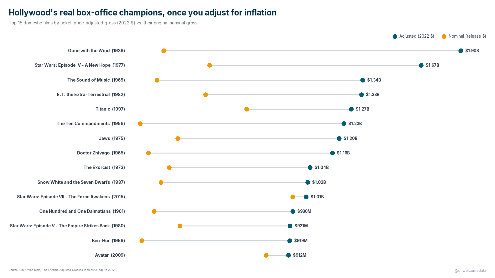

**[@unwelcomedata](https://unwelcomedata.github.io/highest-grossing-films/)** · data from public sources

# Hollywood's real box-office champions, once you adjust for inflation

The all-time domestic box-office chart is dominated by recent superhero films —
but only because ticket prices keep rising. Adjust for **ticket-price inflation**
and the board flips: a 1939 film still sits at #1, and the golden-age classics
crowd the top ten.

**The finding:** measured in 2022 dollars, **Gone with the Wind** (1939) is the
biggest domestic release ever at about **$1.9 billion** — roughly **9×** its
original $201M take. **Star Wars: A New Hope** (1977) and **The Sound of Music**
(1965) follow. The films that lead the *nominal* chart (Force Awakens, Endgame)
only appear once the adjustment is applied, and lower down.

---

## The chart

**Adjusted vs. nominal domestic gross — top 15.** Teal dot = inflation-adjusted
gross (2022 $); gold dot = what the film actually made in its release years. The
length of the connector is the inflation effect: long for the classics, short for
recent films.

---

## How it was measured

The ranking uses **ticket-price inflation**, not general (CPI) inflation. Each
film's estimated lifetime tickets sold are multiplied by the 2022 average ticket
price, so every figure is in 2022 dollars. That effectively ranks films by
**how many people bought tickets** — the fairest cross-era comparison — rather
than by nominal dollars, which always favor the present.

One honest caveat: a film's lifetime total includes its **re-releases**. Classics
like *Gone with the Wind* and *Star Wars* were re-released theatrically several
times, so their totals reflect decades of accumulated audience, not a single run.
Full method, definitions, and caveats are in [SOURCES.md](SOURCES.md).

---

## The data

The published dataset is in [`export/`](export/):

- `highest_grossing_films_v1.csv` — the top 200 films by adjusted domestic gross,
  with nominal gross, estimated tickets, release year, decade, and the
  inflation multiple.
- `highest_grossing_films_v1_codebook.md` — a plain-English description of every
  column.

---

## Sources & license

Box Office Mojo, *Top Lifetime Adjusted Grosses* (domestic, adjusted to 2022
dollars). Full attribution, collection method, and caveats are in
[SOURCES.md](SOURCES.md). Data © IMDb/Box Office Mojo, used for commentary and
analysis. No crowd-edited sources are used.

---

> **AI-Assisted Development**
> This project was built with the assistance of [Kiro](https://kiro.dev), an
> AI-powered development environment. All data-sourcing decisions, methodology
> choices, and published findings are the responsibility of the author. AI was
> used for code generation, data-pipeline construction, and research assistance —
> not for analysis conclusions or editorial judgment.
